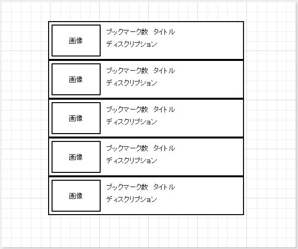

# はてなブックマークリーダー

## やりたいこと

- はてなブックマークのホッテントリを、リクエストしたタイミングのものを取得し、一覧表示する
- 1つのエントリをタップすると、そのエントリページ(WebView想定)を表示する
- エントリページでは、ブックマーク追加ができる(タグの入力/レコメンド選択も可能)

## 画面設計

- ホッテントリ一覧
- エントリ詳細

## 処理設計

- はてなブックマークRSSからホッテントリ一覧を取得する
	- 表示時？取得後、ある程度はSQLite保存か？再取得のタイミングを自分で決めるようにするか？
- 取得できたURLからHEADのみGETし、「og:image」に設定されている画像があれば、それを取得する
	- NoPhoto画像はどうする？

## 表示イメージ

- ホッテントリ一覧

## 開発マイルストーン

- ~~第一目標~~ **2/14 クリア！**
	- ホッテントリ一覧が表示できる
	- エントリ1つをタップするとブラウザが開く
- 第二目標
	- エントリ1つをタップするとエントリページ(WebView)で表示できるようにする
	- エントリページからブックマークできるようにする
- 第三目標
	- タブを実装し、ホッテントリと新着を切り替えられるようにする
